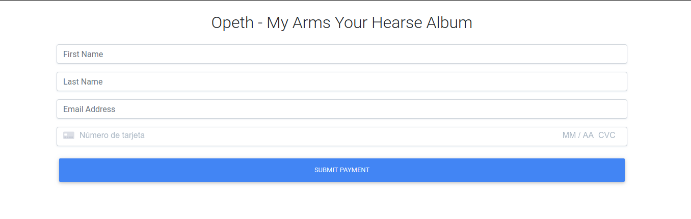
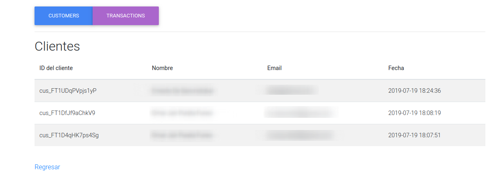
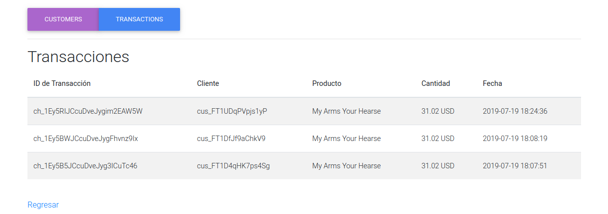

# php-mariadb-stripe
a simple PHP + MariaDB + Stripe payments application.

# IMPORTANT!
Make sure to replace the stripe API keys in `charge.php` and `index.php` and use
your own to ensure proper working. (If you don't you won't see any visible 
changes in your stripe dashboard)

## Requirements 

* `php 7.0+`
* `MySQL or MariaDB`
* `PHPMyAdmin or SQLConsole`
* `A web browser (I recommend Chrome)`
* `Composer`

## How to Run

First of all install the required dependencies using:

`composer`

Next create a database called `paypage` in MySQL / MariaDB by logging into the
console and typing:

```sql
CREATE DATABASE paypage;
```

Next we need to enter our database:

``` sql
use paypage;
```


And import the file `database.sql`:

``` sql
source <path_to_database.sql>
```

You can run the php server and test this tiny-app using:

`php -S 127.0.0.1:8000`

## Screenshots






